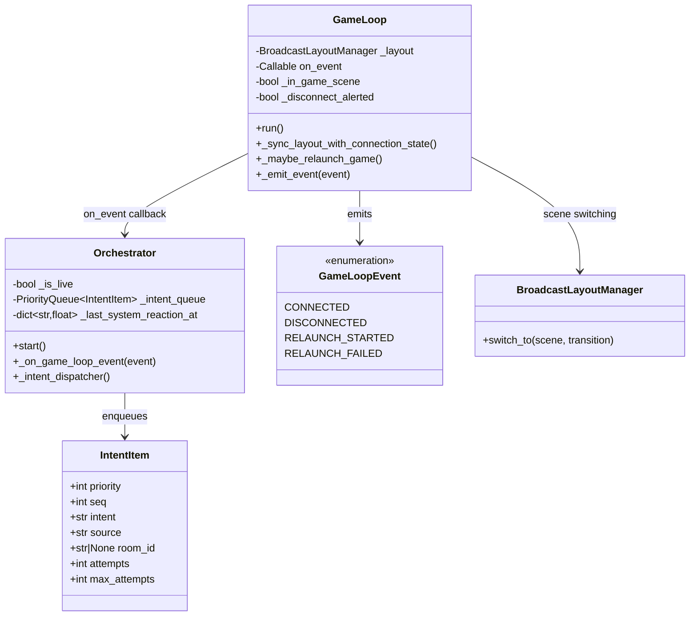

# Reactive Broadcast Avatar Design (2026-03)

Status: Active
Last Updated: 2026-03-27
Scope: `AITuber/orchestrator/**/*.py`

## 1. Background

During stream operation, scene/layout transitions were already automated, but avatar behavior did not consistently react to runtime state changes (bridge disconnect/reconnect/relaunch lifecycle).

This document records the redesign and review loop used to close that gap.

## 2. Problem Review (Cycle 1)

Identified issues:

1. Runtime state changes mostly affected layout/OBS, not avatar intent behavior.
2. Critical system intents could be dropped on transient send failure.
3. `ON_AIR`/live behavior gating had weak runtime linkage in the game-stream path.

## 3. Redesign (Cycle 1)

### 3.1 Core idea

Introduce explicit `GameLoopEvent` events and wire them to high-priority avatar intents in `Orchestrator`.

### 3.2 Event mapping policy

- `CONNECTED` -> `record_observation`
- `DISCONNECTED` -> `processing_lag`
- `RELAUNCH_STARTED` -> `processing_lag`
- `RELAUNCH_FAILED` -> `acknowledge_anomaly`

All mapped intents already exist in `Assets/StreamingAssets/behavior_policy.yml`.

### 3.3 Reliability policy

- System reaction intents use top priority (`PRIORITY_INTERACTIVE`).
- If dispatch fails and `source == system`, retry up to `max_attempts`.
- Add per-intent cooldown to avoid reaction spam during flapping.

## 4. Class Diagram

## 5. Sequence (State Change to Avatar Reaction)

1. `GameLoop` detects bridge state transition in `_sync_layout_with_connection_state`.
2. `GameLoop` emits `GameLoopEvent` through `on_event` callback.
3. `Orchestrator._on_game_loop_event` converts event to policy intent.
4. Intent is enqueued with high priority.
5. `_intent_dispatcher` sends `avatar_intent` (with retry for system source on failure).

## 6. Review (Cycle 2)

Post-redesign checks:

1. Event emission now exists at reconnect/disconnect/relaunch boundaries.
2. Avatar reaction path is explicit and testable.
3. Dispatch reliability improved with bounded retry for system-critical intents.
4. Cooldown prevents repeated identical reactions in short windows.

Residual risk:

- Full broadcast lifecycle (`BroadcastLifecycleManager`) is not yet the single source of truth for `_is_live` across all stream modes. Current implementation hardens game-stream transitions first.

## 7. Test Plan

- Extend `tests/test_game_loop_resilience.py`:
  - event emission on connect/disconnect transitions.
- Extend `tests/test_intent_priority.py`:
  - system intent retry after first send failure.

## 8. Traceability

- FR-LAYOUT-05: disconnected recovery and relaunch handling.
- FR-LAYOUT-06: hide gameplay when bridge is unavailable.
- FR-INTENT-PRIORITY-01: priority queue dispatch semantics.
- FR-GAME-03: game commentary behavior unaffected by this redesign.

## 9. Implementation Notes

- Keep event->intent mapping in `Orchestrator` (policy layer), not in `GameLoop`.
- Keep `GameLoop` focused on state observation and event emission.
- Avoid adding new behavior policy intents unless runtime mapping needs domain expansion.
